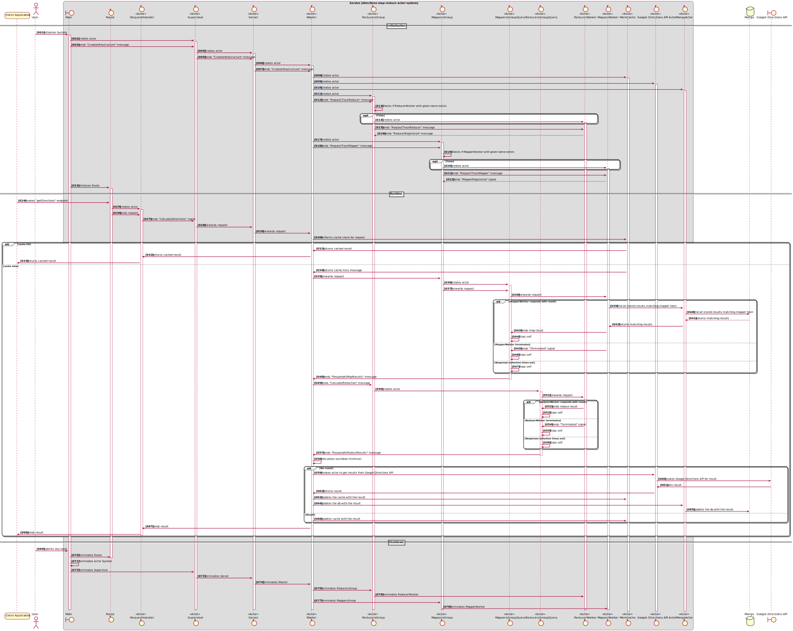

# Directions Map Reduce Server #

[](https://travis-ci.com/steve-papadogiannis/dist-sys-server-scala)
[](https://snyk.io/test/github/steve-papadogiannis/dist-sys-server-scala)

A small project that takes directions queries and produces directions results in polynomial representation.

## Versions ##

* JDK: 1.8.0_251
* SBT: 0.13.18
* Scala: 2.12.2
* google-maps-services SDK: 0.1.20
* Akka Actor: 2.4.18

## Sequence Diagram ## 



## Mongo Setup ##

In `docker/mongo` directory there is a `docker-compose.yml` that 
defines two **Container**s: **Mongo** and **Mongo Express**.

You can issue the below command inside `docker/mongo` 
in order to startup the containers:

```shell
docker-compose up
```

Once the containers are up and running, one can access
**Mongo Express** application at http://localhost:8081

Create a new schema name **dist-sys**

Inside **dist-sys** create a collection named **directions**.

## Build ##

Below command should be issued inside project's directory:

```
sbt clean package
```

## Run ##

Below environment variable should be set before running the project:

```shell
export API_KEY=<the value of the API Key>
```

Below command should be issued inside project's directory:

```sbt
sbt run
```